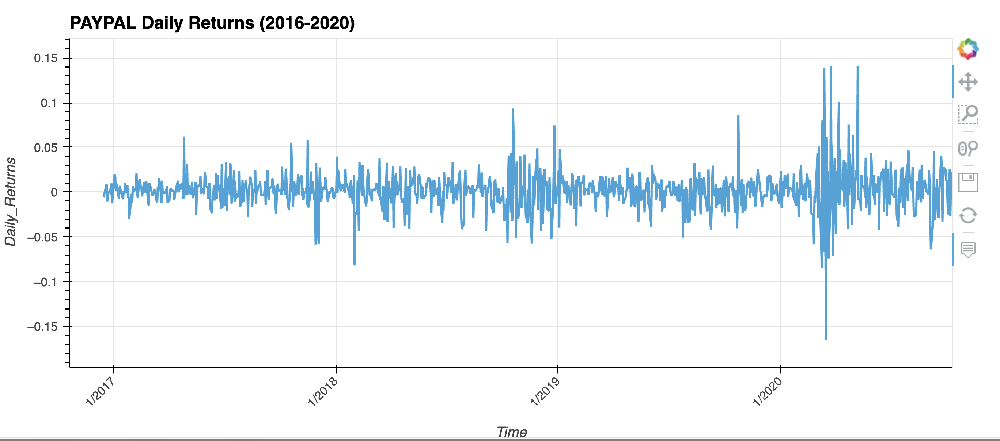
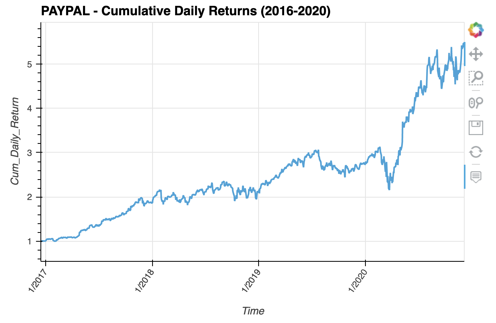
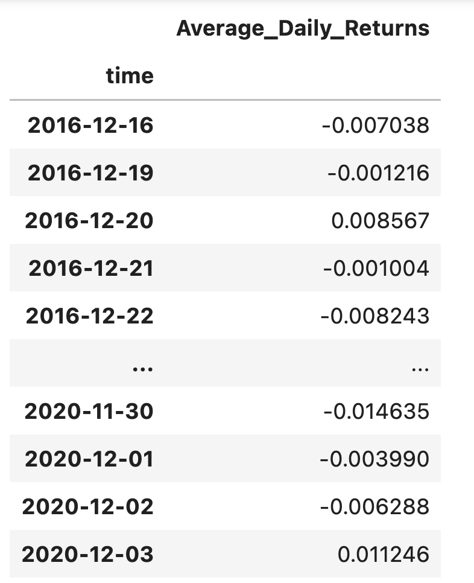
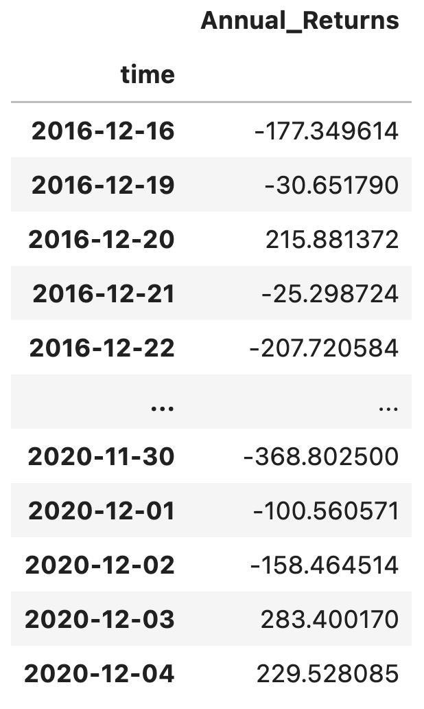
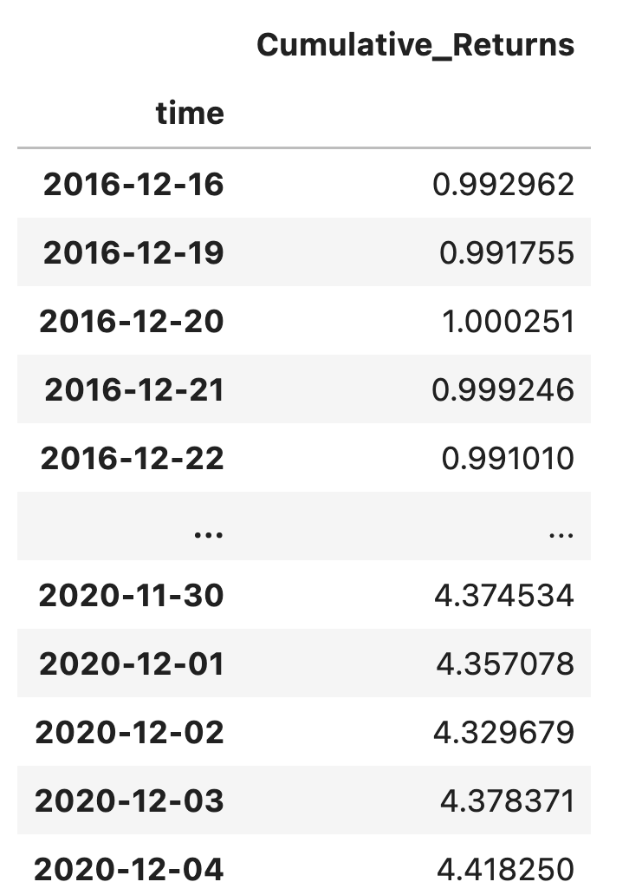
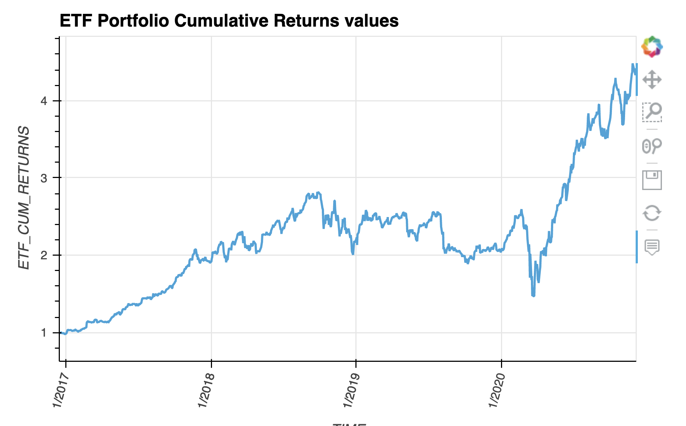

# ETF_ANALYZER #
Exchange-traded fund performance analysis
---
This is a python enabled command line interface that analyzes the performance of  an exchange-traded fund (ETF) portfolio.

Lately,due to technology disruption investors are more inclined to passive investing.Passive investing is a buy and hold portfolio stretegy for long term investment with minimal trading in the market.Investors invest in a basket of assets like stocks or bonds called exchange traded fund(ETF).Exchange traded funds let you invest in lots of securities all at once,adds more diversification and are traded more easily too. It saves your time researching individual stocks or companies or take risk of investing in a single stock.

This analysis consists of:

A Jupyter notebook that contains the following:

* AN analysis of the ETF data that a SQL database stores

* Interactive visualizations

A  video of the web application created by deploying Jupyter notebook via the Voilà library

The Fintech ETF consists of four stocks: GOST, GS, PYPL, and SQ. To analyze the performance of the ETF the following tasks are perfomed:

1. Analyzing a single asset in the ETF,

2. Optimizing data access with Advanced SQL queries,

3. Analyzing the ETF portfolio; and

4. Deploying the notebook as a web application.


## Technologies
This project runs on python 3.7 and includes the following libraries and dependencies:

* Pandas
* Numpy
* hvPlot
* sqlalchemy
* SQL
* Jupyter Notebook
* Voilà 

## Installation Guide

To use the application you need to install the following dependencies.

```python
  pip install SQLAlchemy
  conda install -c pyviz hvplot 
  conda install -c conda-forge voila
```
When the installation completes, confirm it by running the following command:

```
   conda list sqlalchemy
   conda list hvplot
   conda list voila
   
```   

* Make sure to use hvPlot version 0.7.0 or later.
---

## Usage

To use this application just clone the repository and run the **jupyterlab** by running the following command on your terminal:

```jupyterlab```

Upon launching the application  on jupyter lab run the file by clicking on the play button on top of the notebook. 


## Usage Examples

### Single asset analysis in the FinTech ETF ###







### Fintech ETF Portfolio Analysis ###













### ETF ANALYZER Web App ###


[](images/etf_app.mov)


___


## Contributers

Manisha Lal

07/31/2022

manisha.lal.2009@gmail.com
___


## License

copyright 2022